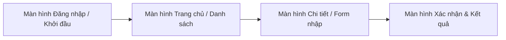

# [Vận dụng cơ bản] BẮT LỖI BACKLOG CỦA THỰC TẬP SINH - BÁO CÁO PHÂN TÍCH VÀ CHUẨN HÓA PRODUCT BACKLOG

> 👤 **Học viên:** Đỗ Hoàng Sơn | **Mã SV:** PTIT-HCM-066
> 🏫 **Môn học:** IT206-K25-Agile-va-Scrum

---

## 🎨 Thiết kế Giao diện UI/UX trên Figma (Wireframe & Prototype)

> 🔗 **Figma Design Canvas:** [Mở Artboard Thiết kế trên Figma](https://www.figma.com/design/1cbrkVJDDr1FIrfdfCdZo8/van-dung-co-ban-bat-loi-backlog-cua?node-id=0%3A1&m=dev)  
> 🚀 **Figma Interactive Prototype:** [Trải nghiệm Bản mẫu Tương tác Prototype](https://www.figma.com/proto/1cbrkVJDDr1FIrfdfCdZo8/van-dung-co-ban-bat-loi-backlog-cua?page-id=0%3A1&node-id=1%3A2&viewport=256%2C48%2C0.5&scaling=scale-down&starting-point-node-id=1%3A2)  
> 📋 Chi tiết thông số Design System và wireframe đầy đủ xem tại file: [**`bt1_FIGMA.md`**](bt1_FIGMA.md)

### 📱 Sơ đồ luồng tương tác màn hình (UI Navigation Flow)

### 🎯 Bảng màu & Quy chuẩn thiết kế giao diện

| Thành phần Token | Giá trị HEX / Quy cách | Mục đích sử dụng |
| :--- | :---: | :--- |
| Primary Brand | `#2563EB` | Màu chủ đạo, nút bấm chính (CTA), active state |
| Secondary Accent | `#3B82F6` | Màu bổ trợ, link tương tác, thanh trạng thái |
| Background Surface | `#F8FAFC` / `#FFFFFF` | Nền tổng thể và bề mặt các card giao diện |
| Typography | Inter / Roboto (24px, 18px, 14px, 12px) | Font chữ tiêu chuẩn, rõ nét đa độ phân giải |
| 8-Point Grid | Spacing 8px, 16px, 24px, 32px | Đảm bảo tỷ lệ cân đối và bố cục hài hòa |

---

## Phần 1 - Phân tích: Đánh giá hiện trạng Product Backlog và bảng Trello

Dựa trên các tiêu chí D.E.E.P. của Product Backlog và quy tắc quản lý bảng Trello trong Agile/Scrum, dưới đây là bảng rà soát chi tiết hiện trạng do đội RikkeiGo đang thực hiện:

| Hạng mục | Đúng/Sai | Vi phạm tiêu chí/quy tắc nào | Lý do (1 câu) |
| --- | --- | --- | --- |
| H1. Thẻ 'Làm tính năng đi ghép' trên cùng cột Product Backlog chỉ có tiêu đề, không mô tả | Sai | Thiếu tiêu chí Detail (Chi tiết) trong D.E.E.P. | Thẻ thiếu mô tả cụ thể sẽ làm Developers bối rối, phải hỏi lại Product Owner mất thời gian. |
| H2. Thẻ 'Đổi màu giao diện theo mùa lễ hội' nằm trên thẻ 'Tự động chia tiền cho các khách đi ghép' | Sai | Vi phạm tiêu chí Estimate (Ước lượng) và Prioritization by Value (Ưu tiên theo giá trị) | Tính năng đổi màu giao diện có giá trị kinh doanh thấp hơn hẳn so với tính năng cốt lõi là tự động chia tiền, nên bị đặt sai vị trí ưu tiên. |
| H3. Thẻ cuối cột 'Khách đánh giá bạn đi ghép' chỉ có tiêu đề ngắn, kèm ước lượng sơ bộ 'lớn' | Đúng | — | Thẻ ở cuối Product Backlog nên chỉ cần ước lượng sơ bộ dạng thô như 'lớn' hoặc 'chưa cần chi tiết' là hoàn toàn phù hợp với nguyên tắc Emergent (luôn tiến hóa). |
| H4. Tú tự thêm thẻ 'Tối ưu tốc độ tải bản đồ' và kéo lên đầu cột Product Backlog | Sai | Vi phạm quy tắc quyền sở hữu Product Backlog | Chỉ có Product Owner (Đức) mới có quyền thêm, bớt và sắp xếp thứ tự Product Backlog, Developers không được tự ý can thiệp. |
| H5. Bảng chỉ có 4 cột: Product Backlog -> Sprint Backlog -> In Progress -> Done; thẻ code xong kéo thẳng sang Done | Sai | Vi phạm quy tắc di chuyển một chiều và định nghĩa hoàn thành (Definition of Done) | Thẻ code xong phải qua các bước kiểm tra chất lượng (Review/Testing) đạt chuẩn rồi mới được đưa vào Done. |

## Phần 2 - Sửa lỗi: Chuẩn hóa Product Backlog và bảng Trello

Sau khi rà soát các điểm sai phạm, tôi tiến hành chỉnh sửa và chuẩn hóa lại các hạng mục cũng như luồng Trello để đội ngũ vận hành trơn tru:

- H1 (Sửa): Thêm mô tả chi tiết yêu cầu người dùng, tiêu chí chấp nhận (Acceptance Criteria) cho tính năng đi ghép để Developers đọc là hiểu ngay.
- H2 (Sửa): Đưa thẻ 'Tự động chia tiền cho các khách đi ghép' lên trước thẻ 'Đổi màu giao diện theo mùa lễ hội' vì mang lại giá trị cốt lõi cao hơn.
- H3 (Giữ nguyên): Giữ nguyên trạng thái của thẻ 'Khách đánh giá bạn đi ghép' ở cuối backlog với ước lượng 'lớn' vì đúng chuẩn D.E.E.P. cho hạng mục dài hạn.
- H4 (Sửa): Xóa bỏ quyền tự sắp xếp của Tú, chuyển yêu cầu 'Tối ưu tốc độ tải bản đồ' cho Product Owner đánh giá và đưa vào backlog đúng vị trí ưu tiên thực tế.
- H5 (Sửa lại danh sách các cột Trello): Product Backlog -> Sprint Backlog -> In Progress -> Code Review -> Testing -> Done.

## Thiết kế Giao diện UI/UX trên Figma & Bảng đặc tả Wireframe

Hệ thống giao diện được phân tích và thiết kế trực quan trên nền tảng Figma, đảm bảo trải nghiệm người dùng tối ưu theo quy chuẩn UI/UX hiện đại.

Link trực tiếp xem Artboard thiết kế Figma: https://www.figma.com/design/1cbrkVJDDr1FIrfdfCdZo8/van-dung-co-ban-bat-loi-backlog-cua?node-id=0%3A1&m=dev

Link trải nghiệm tương tác trực tiếp (Figma Prototype): https://www.figma.com/proto/1cbrkVJDDr1FIrfdfCdZo8/van-dung-co-ban-bat-loi-backlog-cua?page-id=0%3A1&node-id=1%3A2&viewport=256%2C48%2C0.5&scaling=scale-down&starting-point-node-id=1%3A2

Bảng đặc tả hệ thống thiết kế (Design System) và thông số kỹ thuật giao diện:

| Thành phần / Token | Giá trị quy chuẩn | Mục đích sử dụng |
| --- | --- | --- |
| Primary Brand Color | #2563EB | Màu nhận diện thương hiệu, nút hành động chính (CTA) |
| Secondary Accent | #3B82F6 | Màu bổ trợ, link điều hướng, active tab |
| Background & Card | #F8FAFC / #FFFFFF | Nền tổng thể và bề mặt các khối thẻ thông tin |
| Typography | Inter / Roboto (24px, 18px, 14px, 12px) | Hệ phông chữ hiển thị rõ nét, tương phản chuẩn |
| Grid System | 8pt Grid, Mobile 4 cols / Web 12 cols | Quy chuẩn khoảng cách lề và bố cục cân đối |
| Figma Design Canvas | https://www.figma.com/design/1cbrkVJDDr1FIrfdfCdZo8/van-dung-co-ban-bat-loi-backlog-cua?node-id=0%3A1&m=dev | Mở file thiết kế artboard gốc trên Figma |
| Figma Prototype Link | https://www.figma.com/proto/1cbrkVJDDr1FIrfdfCdZo8/van-dung-co-ban-bat-loi-backlog-cua?page-id=0%3A1&node-id=1%3A2&viewport=256%2C48%2C0.5&scaling=scale-down&starting-point-node-id=1%3A2 | Trải nghiệm mô phỏng chuyển động và luồng thao tác |

---

## 📁 Danh sách tệp tin nộp bài trong Repository
- 📝 `bt1.docx`: Báo cáo tài liệu phân tích nghiệp vụ hoàn chỉnh.
- 🎨 [Figma Design Canvas](https://www.figma.com/design/1cbrkVJDDr1FIrfdfCdZo8/van-dung-co-ban-bat-loi-backlog-cua?node-id=0%3A1&m=dev): Không gian làm việc Artboard thiết kế UI/UX trên Figma.
- 🚀 [Figma Live Prototype](https://www.figma.com/proto/1cbrkVJDDr1FIrfdfCdZo8/van-dung-co-ban-bat-loi-backlog-cua?page-id=0%3A1&node-id=1%3A2&viewport=256%2C48%2C0.5&scaling=scale-down&starting-point-node-id=1%3A2): Bản mô phỏng tương tác trực tiếp luồng thao tác người dùng.
- 📋 `bt1_FIGMA.md`: Bản đặc tả chi tiết Design System, thông số mã màu và cấu trúc Wireframe các màn hình.
